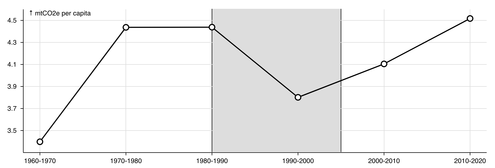

# chrt-range

Component for creating ranges and threshold lines in chrt charts. Ranges can be used to highlight specific intervals of values, while single-value ranges create threshold lines (also known as AB lines). The component supports both vertical and horizontal orientations.



The component provides two main types:

- `chrtVerticalRange`: Creates vertical ranges/lines (along the x-axis)
- `chrtHorizontalRange`: Creates horizontal ranges/lines (along the y-axis)

### Observable Examples and Documentation:

- [Chrt Ranges - Observable](https://observablehq.com/d/7095f7d3311367b6?collection=@chrt/chrt)
- [Introducing Chrt - Observable](https://observablehq.com/@chrt/introducing-chrt?collection=@chrt/chrt)

## Installing

For use with Webpack, Rollup, or other Node-based bundlers, `chrt-range` can be installed as a standalone module via a package manager such as Yarn or npm.

```bash
npm install chrt-range chrt-core
```

`chrt-range` can be used as part of the `chrt` package:

```bash
npm install chrt
```

## Usage

### ES6 / Bundlers (Webpack, Rollup, etc.)

```js
import Chrt from "chrt-core";
import { chrtVerticalRange, chrtHorizontalRange } from "chrt-range";

// Create a vertical range
chrt.Chrt().add(chrtVerticalRange().from(10).to(20));

// Create a horizontal threshold line
chrt.Chrt().add(
  chrtHorizontalRange().from(50).to(50), // same as from to create a line
);
```

## API Reference

### Range Creation

#### `chrtVerticalRange()` / `chrtHorizontalRange()`

Creates a new range component in the specified orientation.

```js
// Vertical range (along x-axis)
chrtVerticalRange().from(dateStart).to(dateEnd);

// Horizontal range (along y-axis)
chrtHorizontalRange().from(minValue).to(maxValue);
```

#### `.from(value)` / `.to(value)`

Sets the start and end points of the range.

```js
// Create a range
chrtVerticalRange().from(0).to(100);

// Create a threshold line
chrtVerticalRange().from(50).to(50); // same value creates a line
```

### Styling

#### `.color([value])` / `.fill([value])`

Sets the fill color of the range area.

```js
chrtVerticalRange().fill("#336699").fillOpacity(0.5);
```

#### `.stroke([value])` / `.strokeWidth([value])`

Sets the color and width of the range borders.

```js
chrtHorizontalRange().stroke("#ff0000").strokeWidth(2);
```

#### Line Styles

Three preset line styles are available for range borders:

```js
// Solid lines (default)
chrtVerticalRange().solid();

// Dashed lines
chrtVerticalRange().dashed();

// Dotted lines
chrtVerticalRange().dotted();
```

#### Opacity

Control the opacity of fill and stroke separately:

```js
chrtVerticalRange().fillOpacity(0.3).strokeOpacity(0.8);
```

### Examples

#### Basic Range

```js
chrt
  .Chrt()
  .add(
    chrtVerticalRange()
      .from(-2)
      .to(1)
      .stroke("#f00")
      .strokeWidth(2)
      .fill("#336699")
      .fillOpacity(0.5),
  );
```

#### Threshold Lines

```js
chrt.Chrt().add(
  chrtHorizontalRange()
    .from(100) // threshold value
    .to(100) // same as from
    .stroke("#00ff00")
    .strokeWidth(2)
    .dashed(),
);
```

#### Multiple Ranges

```js
chrt
  .Chrt()
  .add(chrtVerticalRange().from(dateStart).to(dateEnd).fill("#eee"))
  .add(
    chrtHorizontalRange()
      .from(minThreshold)
      .to(maxThreshold)
      .fill("#ff000033")
      .stroke("#ff0000"),
  );
```

#### Ranges with Time Series

```js
chrt
  .Chrt()
  .x({ scale: "time" })
  .add(
    chrtVerticalRange()
      .from(new Date("2023-01"))
      .to(new Date("2023-06"))
      .fill("#eef")
      .fillOpacity(0.3),
  )
  .add(chrt.line().data(timeSeriesData));
```
